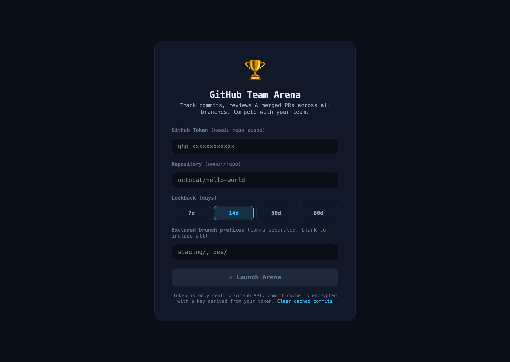
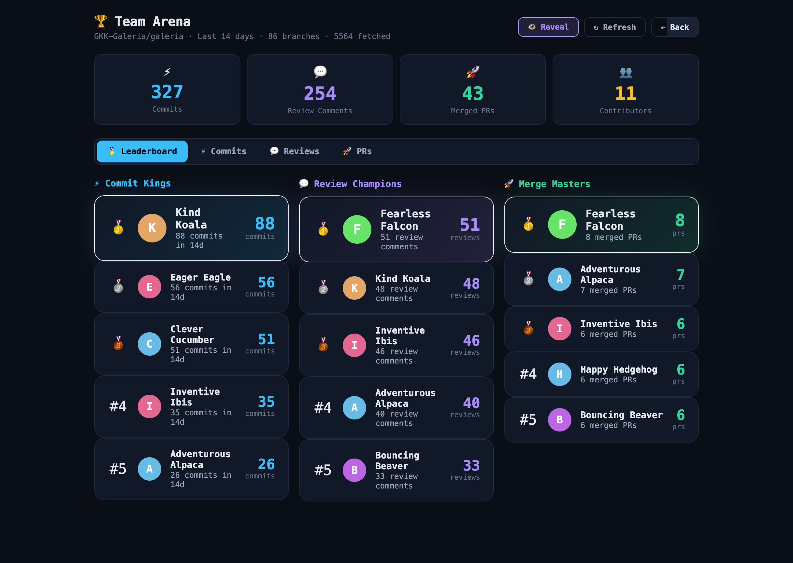
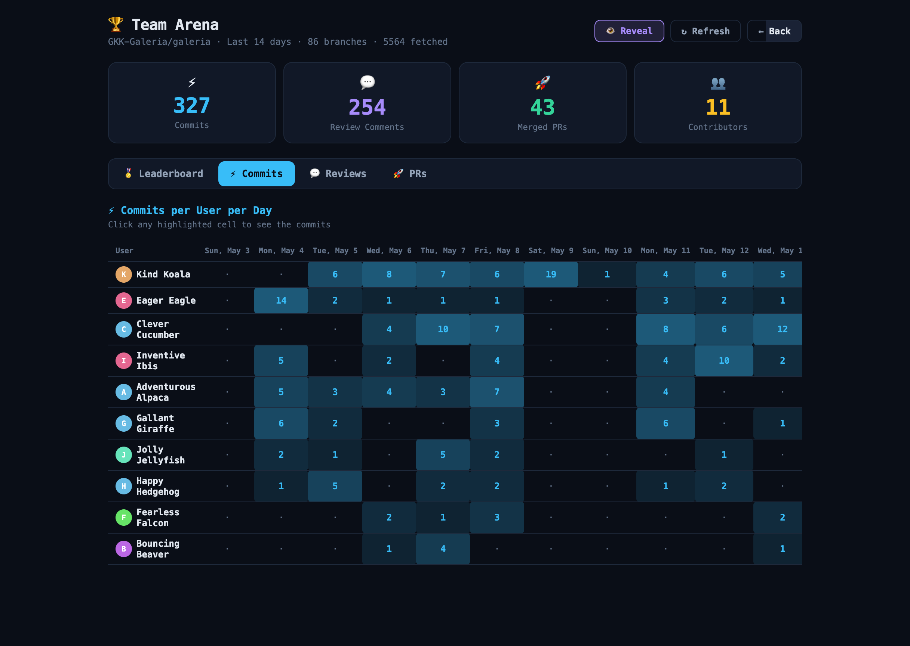
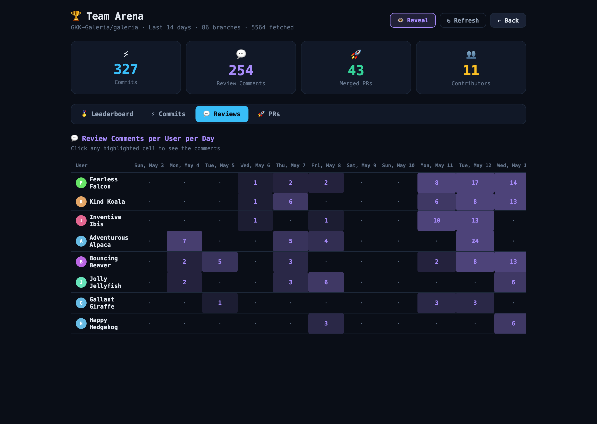
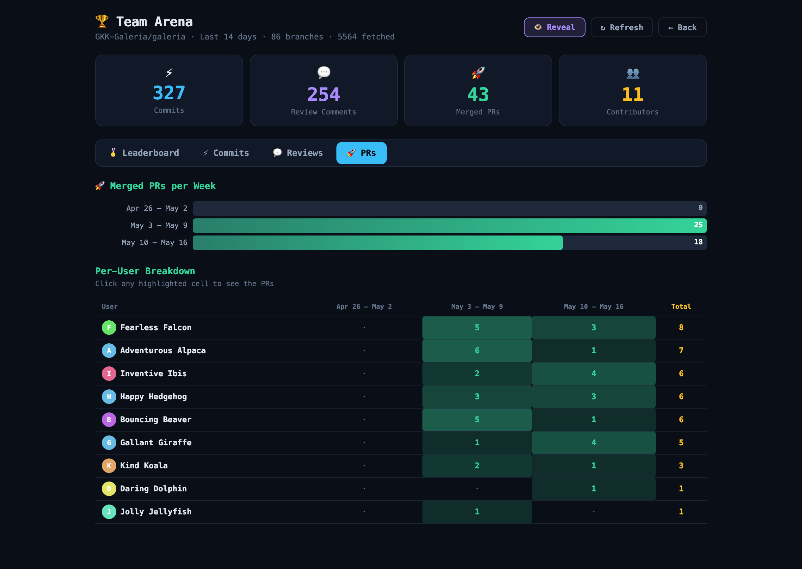

# GitHub Team Arena

A single-file dashboard that turns a GitHub repo into a friendly leaderboard. Track commits, review comments, and merged PRs across **all branches** and see who's on fire this week.

## Screenshots

## Features

- **Leaderboards** — top contributors for commits, review comments, and merged PRs, with medals for the top 3 and a 🔥 badge for users who are over the daily threshold today.
- **Heatmap tables** — commits and reviews per user per day, plus merged PRs per user per week.
- **Drill-down drawer** — click any highlighted cell or leader card to see the underlying commits, review comments, or PRs with links back to GitHub.
- **All branches** — commits are fetched across every non-excluded branch and deduplicated by SHA, so feature-branch work isn't missed.
- **Configurable branch excludes** — defaults to `staging/`; edit the field to skip any prefix.
- **Incremental, encrypted cache** — commits are immutable, so they're cached in `localStorage` encrypted with a key derived from your token (AES-GCM via PBKDF2). Subsequent loads only fetch new commits since the last refresh.
- **Merge-noise filter** — "Merge branch 'main'" style commits are excluded from counts.
- **Adjustable lookback** — 7, 14, 30, or 60 days.
- **Shareable URL** — `?repo=`, `?days=`, and `?exclude=` query params seed the form so teams can bookmark a setup.
- **Zero install** — one HTML file, no build step, no server. Your token is sent only to `api.github.com`.

## Quick start

1. Open [github-team-arena.html](github-team-arena.html) in any modern browser (double-click works, or serve it locally).
2. Paste a GitHub personal access token with `repo` scope.
3. Enter the repository as `owner/repo` (e.g. `octocat/hello-world`).
4. Pick a lookback window and hit **⚡ Launch Arena**.

### Hosting a live demo

The file is fully static, so any static host works. The easiest path is GitHub Pages:

1. In repo settings → Pages, serve from the `main` branch root.
2. Share `https://<user>.github.io/github-team-arena/github-team-arena.html`.

Users still bring their own token — nothing is stored server-side.

### Creating a token

A classic personal access token with the `repo` scope is enough. For fine-grained tokens, grant read access to *Contents*, *Pull requests*, and *Metadata* on the target repository.

## How it works

The page is a self-contained vanilla-JS app (no framework, no bundler). On launch it:

1. Lists every branch in the repo (skipping configured prefixes).
2. Fetches commits from each branch since the lookback date, deduplicating by SHA and tracking which branches each commit appears on. Already-cached commits are reused; only commits newer than the last fetch are pulled.
3. Fetches closed PRs (short-circuiting once the `updated_at` cursor crosses the lookback boundary) and review comments in parallel.
4. Aggregates by user × day (commits, reviews) and user × week (merged PRs), then renders the dashboard.

### Caching

Cache entries live in `localStorage` under the `arena_cache_v1_` prefix, one entry per repo. Each entry is AES-GCM-encrypted with a 256-bit key derived from your GitHub token via PBKDF2 (100k iterations, per-browser salt). If the token changes, the old blob fails to decrypt and is discarded. Entries older than 90 days are pruned automatically. Use the *Clear cached commits* link on the setup screen to drop everything.

## Limitations

- **API rate limits** apply — a 5000/hour authenticated quota is shared across all calls. The app surfaces rate-limit errors with the reset time. Large repos with many branches can chew through the quota quickly on a cold cache; subsequent loads are much cheaper thanks to the incremental cache.
- **Pagination caps**: branches and per-branch commits are capped at 500 (5 pages × 100), PRs/reviews at 1000 (10 pages × 100). If a cap is hit, the dashboard shows a yellow "Partial results" banner naming the affected source.
- **Reviews** counts inline review comments (`/pulls/comments`), not top-level PR comments or review approvals.
- Only **merged** PRs count toward the PR leaderboard. Open and closed-unmerged PRs are ignored.
- PRs targeting an excluded base branch are excluded.
- **Author identity** is the GitHub login when available, otherwise the git-config author name. A contributor whose commits sometimes lack a linked GitHub account will appear under two rows (`alice` and `Alice Example`). Commits with neither a login nor an author name are skipped.

## Contributing

See [CONTRIBUTING.md](CONTRIBUTING.md). The project is intentionally a single HTML file — please keep it that way.

## License

[MIT](LICENSE)
